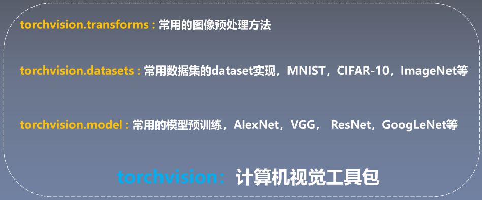
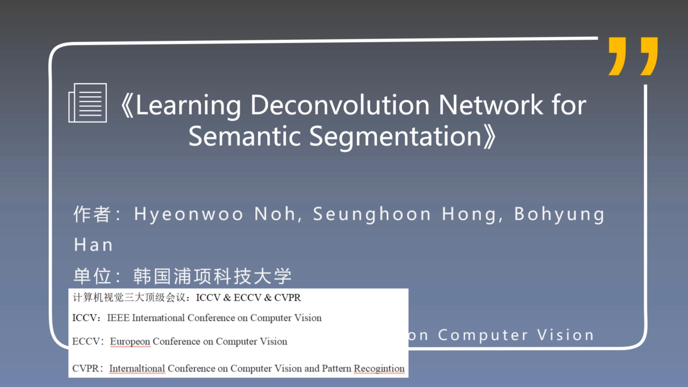

# [1.损失函数和优化器](/损失函数优化器.md)
# [2.fcn模型代码解析](/fcn模型代码解析.md)
# [论文学习笔记](/论文学习笔记)
## [常用数据集](/论文学习笔记\常用数据集.md)
## [1.SegNet_DeconvNet](/论文学习笔记/SegNet_&_DeconvNet.md)
## [2.U-Net_FusionNet](/论文学习笔记/U-Net_&_FusionNet.md)
## [3.1.deeplab代码逻辑](/论文学习笔记/DeepLab代码逻辑.md)
## [3.2.deeplab系列论文](/论文学习笔记/Deeplab系列.md)

torchvision是pytorch的计算机视觉专用包，其中包含的三个模块。

[softmax](https://www.youtube.com/watch?v=ytbYRIN0N4g)

- 对于二维卷积来说，在步长为1，卷积核大小为3的情况下，padding与dilation相等时图像尺寸不变。
