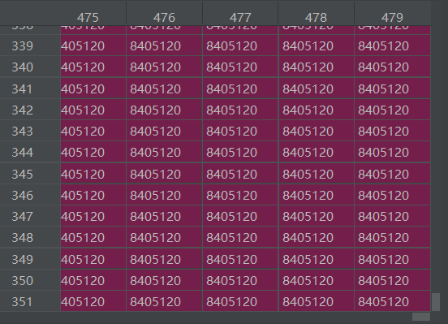
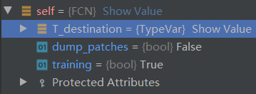
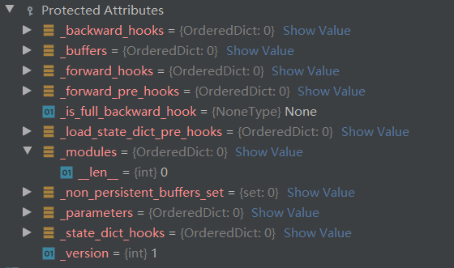
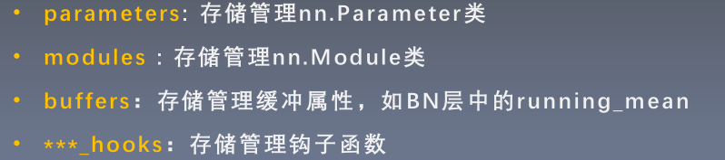
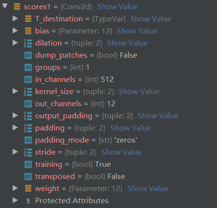
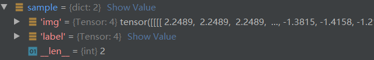
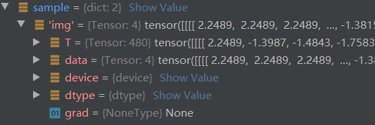
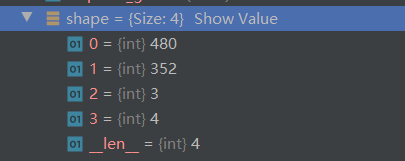
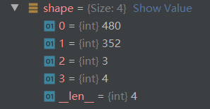
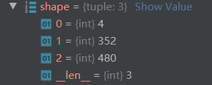

# 1.数据输入
- [导入其他模块或者包报错的问题](https://blog.csdn.net/sinat_32336967/article/details/105058577)：将当前文件夹标记为Sources Root,其作用是将文件目录加入到sys.path中（参考python [文件导入的路径查找顺序](https://www.cnblogs.com/tulintao/p/11196893.html)）。PyCharm打开的当前文件夹不用标记，默认自动加入到sys.path中。
## 1.1 dataset
自己实现的dataset类都继承于`torch.utils.data.Dataset`并且要复写其中的`__getitem__`方法，实现接收一个样本返回一个索引的功能。  
训练集dataset的实例化：
`Cam_train = CamvidDataset([cfg.TRAIN_ROOT, cfg.TRAIN_LABEL], cfg.crop_size)
`参数1：路径列表，2：裁剪尺寸。参数如下：
```python
TRAIN_ROOT = './CamVid/train'  #数据路径
TRAIN_LABEL = './CamVid/train_labels'  #标签路径
crop_size = (352, 480)  #图片的裁剪尺寸
```
### 1.1.1__init__函数
初始化dataset类中的参数。读取数据`self.imgs` `self.labels`，同时设定裁剪尺寸`self.crop_size`。
```python
def __init__(self, file_path=[], crop_size=None):
  self.img_path = file_path[0]
  self.label_path = file_path[1]
  self.imgs = self.read_file(self.img_path)#调用self.read_file
  self.labels = self.read_file(self.label_path)
  self.crop_size = crop_size
```  
`self.labels和self.imgs`分别为所有的标签和训练数据的路径的列表。例如`'./CamVid/train\\0001TP_006690.png'`
### 1.1.2__getitem__函数
功能：输入训练图片和标签的索引，经过中心裁剪、img_transform处理，将训练图片和标签打包为字典返回。
```python
def __getitem__(self, index):
    img = self.imgs[index]
    label = self.labels[index]
    # 从文件名中读取数据（图片和标签都是png格式的图像数据）
    img = Image.open(img)
    label = Image.open(label).convert('RGB')#图片打开为PIL格式

    img, label = self.center_crop(img, label, self.crop_size)
    img, label = self.img_transform(img, label)

    sample = {'img': img, 'label': label}
    return sample
```
`PIL.Image.open`PIL是python中处理图片的库。一般transform在类外部实现，作为参数传入，是数据预处理的主要流程。
### 1.1.3__len__(self)
### 1.1.4 center_crop 中心裁剪函数
功能：裁剪输入PIL图片或者Tensor的大小,返回值也是PIL或者是Tensor格式
```python
def center_crop(self, data, label, crop_size):
    data = ff.center_crop(data, crop_size)
    label = ff.center_crop(label, crop_size)
    return data, label
```
[center_crop](https://pytorch.org/vision/stable/transforms.html?highlight=center_crop#torchvision.transforms.functional.center_crop)


### 1.1.5 read_file(self, path)
功能：输入一个路径，返回其路径下所有文件及文件夹的路径的列表
```python
def read_file(self, path):
  files_list = os.listdir(path)#files_list为输入路径下的文件或者文件夹名字的列表
  file_path_list = [os.path.join(path, img) for img in files_list]
  file_path_list.sort()
  return file_path_list
```
[listdir](https://docs.python.org/3/library/os.html?highlight=os%20listdir#os.listdir)
### 1.1.6 img_transform函数
功能：输入输出都是PIL格式的图片和标签，对图片和标签做些数值处理
```python
def img_transform(self, img, label):
    label = np.array(label)  # 以免不是np格式的数据
    label = Image.fromarray(label.astype('uint8'))
    transform_img = transforms.Compose(
        [
            transforms.ToTensor(),
            transforms.Normalize([0.485, 0.456, 0.406], [0.229, 0.224, 0.225])
        ]
    )
    img = transform_img(img)
    label = label_processor.encode_label_img(label)
    label = t.from_numpy(label)

    return img, label
```
其中对于img的处理封装在了`transforms.Compose`中，对于label主要是一个编码处理。img直接作为PIL图像进行处理，label转为了Image对象进行处理，最后在转为tensor。最后输出中img和label都是tensor。  
`label = label_processor.encode_label_img(label)`对label进行哈希编码，传入的label为PIL格式：
```python
def encode_label_img(self, img):
    data = np.array(img, dtype='int32')
    idx = (data[:, :, 0] * 256 + data[:, :, 1]) * 256 + data[:, :, 2]
    return np.array(self.cm2lbl[idx], dtype='int64')
```
PIL格式的图像经过np.array转换过后维度是[352,480,3]通道数在最后，所以idx是对三个通道上的值进行对应的编码，编码后如下：
      
经过`np.array(self.cm2lbl[idx], dtype='int64')`变换后为：  
  


## 1.2 Dataloader
功能：构建可迭代的数据装载器。
```python
train_data = DataLoader(Cam_train, batch_size=cfg.BATCH_SIZE, shuffle=True, num_workers=0)
```
常用参数：
  - `dataset`：决定从哪里读取数据，就是前边实现的dataset类
  - `batch_size`：训练数据的批大小。
  - `num_workers`：是否使用多进程读取数据
  - `shuffle`：每个epoch是否乱序
  - `drop_last`：当样本不能被batchsize整除时，是否舍弃最后一批数据
### 1.2.1__init__函数,DataLoader的初始化
### 1.2.2dataloader的调用
```python
for i, sample in enumerate(train_data):
```
`train_data`在for循环中使用，首先调用`__iter__`函数，随后进行进程判断，调用`self._get_iterator`。`__iter__`函数生成了一个`_BaseDataLoaderIter`的迭代器。
```python
def __iter__(self) -> '_BaseDataLoaderIter':
    if self.persistent_workers and self.num_workers > 0:
        if self._iterator is None:
            self._iterator = self._get_iterator()
        else:
            self._iterator._reset(self)
        return self._iterator
    else:
        return self._get_iterator()
```
随后调用`_BaseDataLoaderIter`中的`__next__`函数。在`__next__`函数中调用`_next_data`：
```python
 data = self._next_data()
```
在`_next_data`中调用`_next_index`获取所需数据的索引
```python
def _next_data(self):
    index = self._next_index()  # may raise StopIteration
    data = self._dataset_fetcher.fetch(index)  # may raise StopIteration
    if self._pin_memory:
        data = _utils.pin_memory.pin_memory(data)
    return data
```
在`_next_index`函数中，进入`BatchSampler`的`__iter__`函数,在`__iter__`函数中将一个batch数据的索引打包成列表，用采样器`sampler`来获取数据索引:
```python
def __iter__(self):
    batch = []
    for idx in self.sampler:
        batch.append(idx)
```
```python  
def _next_index(self):
    return next(self._sampler_iter)
```
最后生成的数据为[tensor,...,tensor]:
```python
data = [self.dataset[idx] for idx in possibly_batched_index]
```
# 2.FCN模型搭建
`class FCN(nn.Module):`fcn模型及常用的网络层都继承于`nn.Module`，在pytorch中都是Module的概念。
## 2.1 nn.Module代码解析
```python
self.training = True
self._parameters = OrderedDict()
self._buffers = OrderedDict()
self._non_persistent_buffers_set = set()
self._backward_hooks = OrderedDict()
self._is_full_backward_hook = None
self._forward_hooks = OrderedDict()
self._forward_pre_hooks = OrderedDict()
self._state_dict_hooks = OrderedDict()
self._load_state_dict_pre_hooks = OrderedDict()
self._modules = OrderedDict()
```
`nn.Module`的__init__函数中，初始化了8个有序字典(OrderedDict)用来管理模型相关参数。
## 2.2 FCN模型初始化
```python
class FCN(nn.Module):
    def __init__(self, num_classes):
      super().__init__()
```
fcn模型初始化需要传入`num_classes`参数，代表最终的分类数。`__init__`函数初始化了整个模型所需要的的网络层，随后这些网络层会在`forward`函数中进行拼接。  
  
执行父类的__init__()函数过后，出现如图四个属性：
- `T_destination`：
- `dump_patchs`：
- `training`：指示说明模型是出于训练模式还是测试模式，如果处于测试模式则非叶子结点不用求取梯度。
- `protected Attributes`:存放了管理模型的八个有序字典，此时八个字典都为空，字典中只有一个`__len__`元素。  
  


新添加的网络层出现在self的属性之中，依旧有以上四个属性来描述，同属于Module的概念。 **猜测：对于包含子模块的模块，都是用这四个属性来描述。**
  
同时self的`_modules`字典中也会出现该模块，说明`stage1`是从属于fcn模型下的子模块。  
对于具体的模块，比如`self.scores1 = nn.Conv2d(512, num_classes, 1)`其描述如下：  
  
其中的可训练参数为`weight 和 bias`
## 2.3模型调用

# 3. 损失函数
损失函数相当于实现了一个特殊的网络层。
[损失函数和优化器笔记](/损失函数优化器.md)
```python
criterion = nn.NLLLoss().to(device)
```
## 3.1 NLLLoss的初始化
```python
def __init__(self, weight: Optional[Tensor] = None, size_average=None, ignore_index: int = -100,
             reduce=None, reduction: str = 'mean') -> None:
    super(NLLLoss, self).__init__(weight, size_average, reduce, reduction)
    self.ignore_index = ignore_index
```
常用参数：
- `weight`：为各个类别的loss值设置权值
- `ignore_index`：设置忽略某个类别
- `reduction`：loss的计算模式，“none”逐个元素计算，“sum”所有元素求和返回标量，“mean”加权平均然后返回标量。  

NLLLoss的继承关系：`NLLLoss()`->`_WeightedLoss`->`_Loss`->`Module` ，
`reduction`的设置在`_Loss`中。
## 3.2 NLLLoss的调用
```python
def forward(self, input: Tensor, target: Tensor) -> Tensor:
    assert self.weight is None or isinstance(self.weight, Tensor)
    return F.nll_loss(input, target, weight=self.weight, ignore_index=self.ignore_index, reduction=self.reduction)
```
模型输出数据和标签数据都必须是tensor，同时NLLLoss的返回值也为tensor。
# 4. 优化器
```python
optimizer = optim.Adam(fcn.parameters(), lr=1e-4)
```
- fcn.parameters：是一个generater，里面保存了fcn的可训练参数
## 4.1 优化器初始化
```python
class Adam(Optimizer):
  def __init__(self, params, lr=1e-3, betas=(0.9, 0.999), eps=1e-8,
                   weight_decay=0, amsgrad=False):
      defaults = dict(lr=lr, betas=betas, eps=eps,
                      weight_decay=weight_decay, amsgrad=amsgrad)
      super(Adam, self).__init__(params, defaults)
```
Adam的初始化，将学习率`lr`、`betas`、`eps`、`weight_decay`、`amsgrad`五个参数打包成字典赋值给了`defaults`,随后`params`和`defaults`作为参数来执行父类Optimizer的初始化，Optimizer初始化了四个基本属性用来管理优化器：
- defaults：就是Adam中的defaults,用来管理优化器的超参数
- state：参数的缓存，比如momentum需要缓存之前的参数来更新现在的参数
- params_groups：优化器管理的参数组列表，列表中每一个元素都是字典，字典中的值才是真正要管理的参数。
- _step_count：记录更新次数，学习率调整时使用
## 4.2 优化器的学习率调整策略
```python
print('Epoch is [{}/{}]'.format(epoch + 1, cfg.EPOCH_NUMBER))
if epoch % 50 == 0 and epoch != 0:
    for group in optimizer.param_groups:
        group['lr'] *= 0.5
```
`optimizer.param_groups`的lr属性代表的是学习率
# 5.fcn中的数据流动
首先从数据装载器`train_data`中获取数据存储在sample中：
```python
for i, sample in enumerate(train_data):
```
sample为字典格式：  
  
其中包含组键值对，分别是`img`和`label`其中保存的值如下：
  
值保存在`T`和`data`中，其余变量则为描述tensor的属性。 **`T`和`data`的形状是不相同的，为什么？其各自的功能是什么？**  
  
   
随后`img`和`label`分别赋值给了`imgdata`和`img_label`
```python
img_data = Variable(sample['img'].to(device))   # [4, 3, 352, 480]
img_label = Variable(sample['label'].to(device))    # [4, 352, 480]
```
`imgdata`送入模型中进行训练：
```python
out = net(img_data)     # [4, 12, 352, 480]
out = F.log_softmax(out, dim=1)#由于是NLLLloss所以要手动计算log_softmax
```
## 5.1 模型评估
```python
pre_label = out.max(dim=1)[1].data.cpu().numpy()    # (4, 352, 480)
pre_label = [i for i in pre_label]
```
表明获取out的最大值索引，转为data的形式，放在CPU上计算，最后转为numpy的形式。固定写法。out的输出维度如下：  
  
4为batch_size大小，12通道数：没个像素属于这12个类中的概率大小，352x480为图片尺寸。经过`out.max(dim=1)[1].data.cpu().numpy()`转换后维度如下：  
  
其中`dim = **`就表示在该维度上经过`log_softmax`变换后相加为1. [log_softmax维度](https://blog.csdn.net/sunyueqinghit/article/details/101113251)  
`max`函数的返回值：
- 0.最大值本身
- 1.最大值的索引
```python
true_label = img_label.data.cpu().numpy()   # (4, 352, 480)
true_label = [i for i in true_label]
```
真实的标签也做相同的处理。
```python
eval_metrix = eval_semantic_segmentation(pre_label, true_label)
```
计算混淆矩阵，`eval_semantic_segmentation`接收两个参数：
- `pre_label`：预测值
- `true_label`：真实值
```python
if max(best) <= train_miou / len(train_data):
    best.append(train_miou / len(train_data))
    t.save(net.state_dict(), '{}.pth'.format(epoch))
```
训练的最好miou都保存在best列表中，最后用torch自带的方法保存最好的训练权重。
