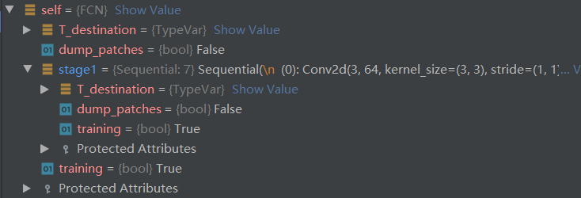

# 1.数据输入
- [导入其他模块或者包报错的问题](https://blog.csdn.net/sinat_32336967/article/details/105058577)：将当前文件夹标记为Sources Root,其作用是将文件目录加入到sys.path中（参考python [文件导入的路径查找顺序](https://www.cnblogs.com/tulintao/p/11196893.html)）。PyCharm打开的当前文件夹不用标记，默认自动加入到sys.path中。
## 1.1 dataset
自己实现的dataset类都继承于`torch.utils.data.Dataset`并且要复写其中的`__getitem__`方法，实现接收一个样本返回一个索引的功能。  
训练集dataset的实例化：
`Cam_train = CamvidDataset([cfg.TRAIN_ROOT, cfg.TRAIN_LABEL], cfg.crop_size)
`参数1：路径列表，2：裁剪尺寸。参数如下：
```python
TRAIN_ROOT = './CamVid/train'  #数据路径
TRAIN_LABEL = './CamVid/train_labels'  #标签路径
crop_size = (352, 480)  #图片的裁剪尺寸
```
### 1.1.1__init__函数
初始化dataset类中的参数。读取数据`self.imgs` `self.labels`，同时设定裁剪尺寸`self.crop_size`。
```python
def __init__(self, file_path=[], crop_size=None):
  self.img_path = file_path[0]
  self.label_path = file_path[1]
  self.imgs = self.read_file(self.img_path)#调用self.read_file
  self.labels = self.read_file(self.label_path)
  self.crop_size = crop_size
```  
`self.labels和self.imgs`分别为所有的标签和训练数据的路径的列表。例如`'./CamVid/train\\0001TP_006690.png'`
### 1.1.2__getitem__函数
功能：输入训练图片和标签的索引，经过中心裁剪、img_transform处理，将训练图片和标签打包为字典返回。
```python
def __getitem__(self, index):
    img = self.imgs[index]
    label = self.labels[index]
    # 从文件名中读取数据（图片和标签都是png格式的图像数据）
    img = Image.open(img)
    label = Image.open(label).convert('RGB')#图片打开为PIL格式

    img, label = self.center_crop(img, label, self.crop_size)
    img, label = self.img_transform(img, label)

    sample = {'img': img, 'label': label}
    return sample
```
`PIL.Image.open`PIL是python中处理图片的库。一般transform在类外部实现，作为参数传入，是数据预处理的主要流程。
### 1.1.3__len__(self)
### 1.1.4 center_crop 中心裁剪函数
功能：裁剪输入PIL图片或者Tensor的大小,返回值也是PIL或者是Tensor格式
```python
def center_crop(self, data, label, crop_size):
    data = ff.center_crop(data, crop_size)
    label = ff.center_crop(label, crop_size)
    return data, label
```
[center_crop](https://pytorch.org/vision/stable/transforms.html?highlight=center_crop#torchvision.transforms.functional.center_crop)


### 1.1.5 read_file(self, path)
功能：输入一个路径，返回其路径下所有文件及文件夹的路径的列表
```python
def read_file(self, path):
  files_list = os.listdir(path)#files_list为输入路径下的文件或者文件夹名字的列表
  file_path_list = [os.path.join(path, img) for img in files_list]
  file_path_list.sort()
  return file_path_list
```
[listdir](https://docs.python.org/3/library/os.html?highlight=os%20listdir#os.listdir)
### 1.1.6 img_transform函数
功能：输入输出都是PIL格式的图片和标签，对图片和标签做些数值处理
```python
def img_transform(self, img, label):
    label = np.array(label)  # 以免不是np格式的数据
    label = Image.fromarray(label.astype('uint8'))
    transform_img = transforms.Compose(
        [
            transforms.ToTensor(),
            transforms.Normalize([0.485, 0.456, 0.406], [0.229, 0.224, 0.225])
        ]
    )
    img = transform_img(img)
    label = label_processor.encode_label_img(label)
    label = t.from_numpy(label)

    return img, label
```
其中对于img的处理封装在了`transforms.Compose`中，对于label主要是一个编码处理。img直接作为PIL图像进行处理，label转为了Image对象进行处理，最后在转为tensor。最后输出中img和label都是tensor。


## 1.2 Dataloader
功能：构建可迭代的数据装载器。
```python
train_data = DataLoader(Cam_train, batch_size=cfg.BATCH_SIZE, shuffle=True, num_workers=0)
```
常用参数：
  - `dataset`：决定从哪里读取数据，就是前边实现的dataset类
  - `batch_size`：训练数据的批大小。
  - `num_workers`：是否使用多进程读取数据
  - `shuffle`：每个epoch是否乱序
  - `drop_last`：当样本不能被batchsize整除时，是否舍弃最后一批数据
### 1.2.1__init__函数,DataLoader的初始化
```python
torch._C._log_api_usage_once("python.data_loader")#语句作用？？
```

# 2.FCN模型搭建
`class FCN(nn.Module):`fcn模型及常用的网络层都继承于`nn.Module`，在pytorch中都是Module的概念。
## 2.1 nn.Module代码解析
```python
self.training = True
self._parameters = OrderedDict()
self._buffers = OrderedDict()
self._non_persistent_buffers_set = set()
self._backward_hooks = OrderedDict()
self._is_full_backward_hook = None
self._forward_hooks = OrderedDict()
self._forward_pre_hooks = OrderedDict()
self._state_dict_hooks = OrderedDict()
self._load_state_dict_pre_hooks = OrderedDict()
self._modules = OrderedDict()
```
`nn.Module`的__init__函数中，初始化了8个有序字典(OrderedDict)用来管理模型相关参数。
## 2.2 FCN模型初始化
```python
class FCN(nn.Module):
    def __init__(self, num_classes):
      super().__init__()
```
fcn模型初始化需要传入`num_classes`参数，代表最终的分类数。`__init__`函数初始化了整个模型所需要的的网络层，随后这些网络层会在`forward`函数中进行拼接。  
  
执行父类的__init__()函数过后，出现如图四个属性：
- `T_destination`：
- `dump_patchs`：
- `training`：指示说明模型是出于训练模式还是测试模式，如果处于测试模式则叶子结点不用求取梯度。
- `protected Attributes`:存放了管理模型的八个有序字典，此时八个字典都为空，字典中只有一个`__len__`元素。  
  


新添加的网络层出现在self的属性之中，依旧有以上四个属性来描述，同属于Module的概念。 **猜测：对于包含子模块的模块，都是用这四个属性来描述。**
  
同时self的`_modules`字典中也会出现该模块，说明`stage1`是从属于fcn模型下的子模块。  
对于具体的模块，比如`self.scores1 = nn.Conv2d(512, num_classes, 1)`其描述如下：  
  
其中的可训练参数为`weight 和 bias`
## 2.3模型调用

# 3. 损失函数
[sunshi ](/损失函数优化器.md/##3-2 "优化器2")
