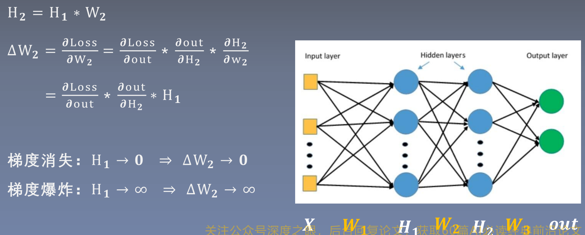
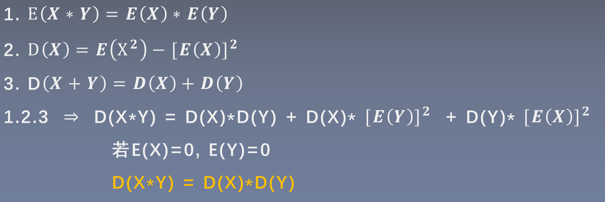
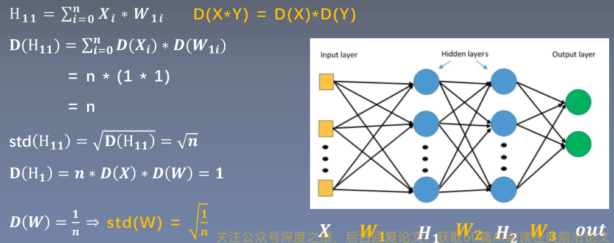
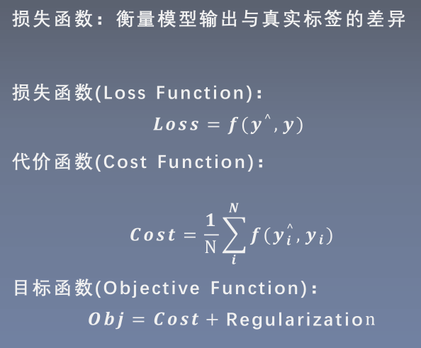

# 1.权值初始化
- 适当的权值初始化可以加快模型收敛，反之可能导致梯度消失或者梯度爆炸
## 1.1梯度的消失与爆炸
当前层的梯度与上一层的输出相关
[(方差、标准差)](https://zhuanlan.zhihu.com/p/83410946)  
两个随机变量乘积的方差推导公式
  
如果输入和随机变量的都是零均值1标准差的话，那么网络层的输出都会较前一层扩大 $\sqrt{n}$ 倍，输入一般会进行归一化处理，所以只能通过权值的初始化处理来维持标准差不变，避免梯度消失或者爆炸。

## 1.2具有激活函数时的初始化
- 由于加入了激活函数会破坏原本的数据分布，可能会导致梯度消失
```python
tanh_gain = nn.init.caculate_gain('tanh') # 计算tanh激活函数的增益：D（输入）/D(输出)
```

# 2.损失函数
  

# 3.优化器
