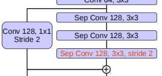
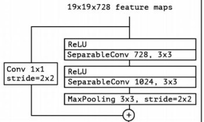

# 1.batch normal层
# 2.DeepLabv3+代码解析
## 2.1深度可分离卷积
## 2.2Block模块
### 2.2.1 block模块生成的第一类模块
```python
first_block = Block(in_channels=64, out_channels=128, reps=2, stride=2, dilation=1, star_with_relu=False, grow_first=True, is_last=False)
```
  
  
  
### 2.2.2 block模块生成的第二类模块  
```python
sec_block = Block(in_channels=128, out_channels=256, reps=2, stride=2, dilation=1, star_with_relu=True, grow_first=True, is_last=False)
```  
  
  
  

### 2.2.3 block模块生成的第三类模块  
```python
third_block = Block(in_channels=728, out_channels=728, reps=3, stride=1, dilation=1, star_with_relu=True, grow_first=True, is_last=False)
```
- `dilation`和output_stride相关  

  
  

### 2.2.4 block模块生成的第四类模块   
```python
four_block = Block(in_channels=728, out_channels=1024, reps=2, stride=1, dilation=1, star_with_relu=True, grow_first=False, is_last=False)
```  
   
  


## 2.3X-ception模块
##
