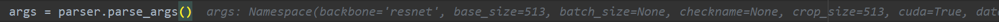

# 1.train.py中的main
- 模型训练的主逻辑
```python
parser = argparse.ArgumentParser(description="PyTorch DeeplabV3Plus Training")
```  
实例化了一个命令行解析的对象 [parser](https://blog.csdn.net/the_time_runner/article/details/97941409)，添加参数完成后如下：  
  
