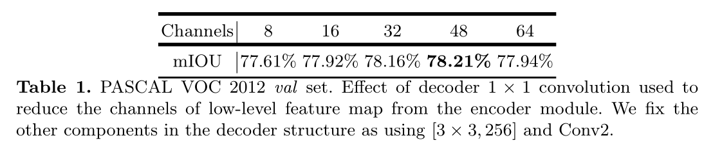
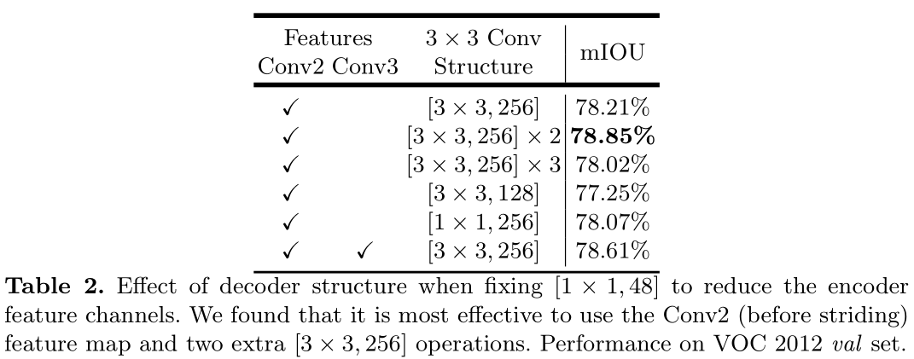
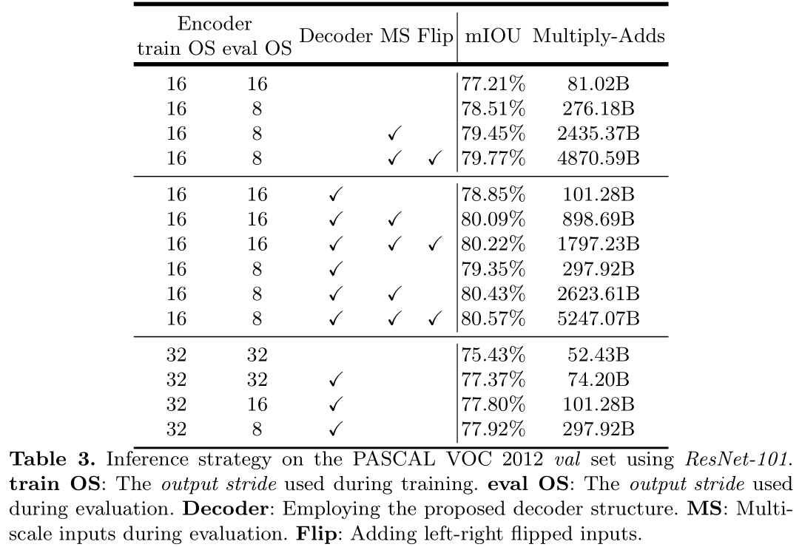

# 1.Deeplab v1
## 1.1摘要
- DCNNs在最近的语义分割和木标识别等高级视觉任务中取得了非常好的效果。
> Deep Convolutional Neural Networks (DCNNs) have recently shown state of the art performance in high level vision tasks, such as image classification and object detection.

- 我们将DCNNs和概率图模型相结合来解决像素级的分类任务（语义分割）。
>  This work brings together methods from DCNNs and probabilistic graphical models for addressing the task of pixel-level classification (also called”semantic image segmentation”).  

- 我们证明了DCNNs的最后一层没有对目标语义信息进行精确定位的能力。  
> We show that responses at the final layer of DCNNs are not sufficiently localized for accurate object segmentation.  

- DCNNs对高层次任务的好效果来源于其良好的不变性
> This is due to the very invariance properties that make DCNNs good for high level tasks.  

- 我们通过在DCNNs的最后一层连接了一个全连接的条件随机场来克服其较差的定位能力。  
> We overcome this poor localization property of deep networks by combining the responses at the final DCNN layer with a fully connected Conditional Random Field (CRF).   

- 模型结果概括
> Qualitatively, our “DeepLab” system is able to localize segment boundaries at a level of accuracy which is beyond previous methods. Quantitatively, our method sets the new state-of-art at the PASCAL VOC-2012 semantic image segmentation task, reaching 71.6% IOU accuracy in the test set. We show how these results can be obtained efficiently: Careful network re-purposing and a novel application of the ’hole’ algorithm from the wavelet community allow dense computation of neural net responses at 8 frames per second on a modern GPU.

## 1.2引言
# 4.DeepLabv3
## 4.1 摘要
- 融合了空间金字塔池化和编解码结构。
> The former networks are able to encode multi-scale contextual information by probing the incoming features with filters or pooling operations at multiple rates and multiple effective fields-of-view, while the latter networks can capture sharper object boundaries by gradually recovering the spatial information.  

- 相比较与deeplabv3填加了解码器部分
> Specifically, our proposed model, DeepLabv3+, extends DeepLabv3 by adding a simple yet effective decoder module to refine the segmentation results especially along object boundaries.  

- 将网络主干更换为了Xception同时应用了深度可分离卷积和aspp模块
> We further explore the Xception model and apply the depthwise separable convolutionto both Atrous Spatial Pyramid Pooling and decoder modules, resultingin a faster and stronger encoder-decoder network.  

## 4.2 引言
- 基于fcn的语义分割算法取得了更好的效果，空间金字塔池化用来捕获丰富的上下文信息，编解码模块用来获取清晰的目标边界

- 即使上下文信息已经编码在了最后一层特征图中，目标的边界信息却由于池化和带步长的卷积操作丢失了，空洞卷积提取到了更加密集的特征图可以缓解这种情况。但是在网络层复杂和显存受限的情况下，计算开销是负担不起的。编解码结构 `since nofeatures are dilated`在收缩路径中，所以计算快速，故尝试将获取多尺度上下文信息模块嵌入进编解码结构中。

- 简述文章结构：空洞卷积可以根据计算资源人为控制输出特征图的分辨率。

- 简述深度可分离卷积及文章主要贡献

## 4.3 相关工作
- 基于fcn的模型，充分利用上下文信息的方法：
  - 利用多尺度输入
  - crf后处理

- 空间金字塔池化：有效的利用了上下文信息

- 编解码网络：
  - 组成
    - 逐步缩小特征图尺寸获取高级语义信息的编码模块
    - 逐步恢复空间尺度的解码模块  
  - 基于这个想法，将v3作为了编码器

- 深度可分离卷积：在不降低网络性能（甚至有提升）的情况下，有效的减少了计算量和参数量

## 4.3 算法
### 4.3.1 带空洞卷积的编解码网络
- 空洞卷积：
  - 方便的调整输出特征图的分辨率
  - 调整卷积核的感受野以获取多尺度信息

- 深度可分离卷积：由深度卷积和1x1卷积组成
  - 极大地降低了计算复杂度
  - 深度卷积在每一个通道上独立的进行卷积，逐点卷积将深度卷积的输出进行整合
  - 将两者结合构成了带孔可分离卷积（atrous separable convolution）

- 将v3作为编码器:
  - output stride参数的意义
  - 相比于分类网络的os=32，可以用不同膨胀率的空洞卷积代替后两层的下采样操作来获取更密集的特征图输出。
  - 编码器的输出为logits之前的网络层，有256通道数。

- 解码器：
  - os=16：将编码器输出进行四倍上采样后同低级特征进行concat，低级特征图需要经过1x1的卷积来降低通道数来避免concat时喧宾夺主。
  - os=8：分割性能略微提升，计算开销变大

### 4.3.2调整后的Aligned Xception
- 基于MSRA的模型做的调整：
  - 将Xception加深
  - 所有的最大值池化都替换成了步长为2的深度可分离卷积
  - 每个3x3的深度可分离卷积后边都添加了batch Normalization和RELU

## 4.4 实验评估
- 主干网络分为Xception和ResNet101

- PASCAL VOC 2012数据集
  - 训练图片1464，验证图片1449，测试图片1456
  - 数据增强后10582张训练图片

- 训练形式：
  - poly学习率调整策略，初始学习率为0.007
  - 图片裁剪尺寸513x513
  - 对bn层参数进行微调，当os为16时。
  - 训练时进行random scale data augmentation
  - **训练为端到端的训练，并且每个部分都没有分段预训练？**

### 4.4.1 解码器设计
- 定义`DeepLabv3 feature map`为v3的最后一个特征图

- 直接使用16倍双线性插值作为一个简单的解码器比不用解码器（训练时将gt做下采样）效果好。对于解码器有三处可以做选择性的改动（用来做对比实验？）：
  - 用来给低级特征缩减通道数的1x1卷积
  - 用来获取锋利分割效果的3x3卷积
  - 用编码器中的哪一个低级特征

- 为了评估1x1卷积的影响，在控制其他变量不变的情况下（用[3,3,256]特征图和conv2）来评估1x1卷积通道数，对模型性能的影响。  
  
可见通道数为48或者32时效果最好，本文采用的是[1,1,48]

- 对于concat后的卷积操作实验结果如下：  
  
最后一种情况：解码器同时利用了conv2和conv3的特征图  ？

### 4.4.2 ResNet101作为骨干网络
- 为了评估模型的准确性和速度提出了两个参数：
  - mIOU
  - [Multiply-Adds](https://stackoverflow.com/questions/51077386/how-to-count-multiply-adds-operations)： [FLOPS和FLOPs](https://blog.csdn.net/mynodex/article/details/101432921)  
  - 由于加入了空洞卷积，所以可以在训练和评估阶段获得不同分辨率的特征图  

  

### 4.4.3 Xception作为骨干网络
### 4.4.4 目标边界分割上的提升
