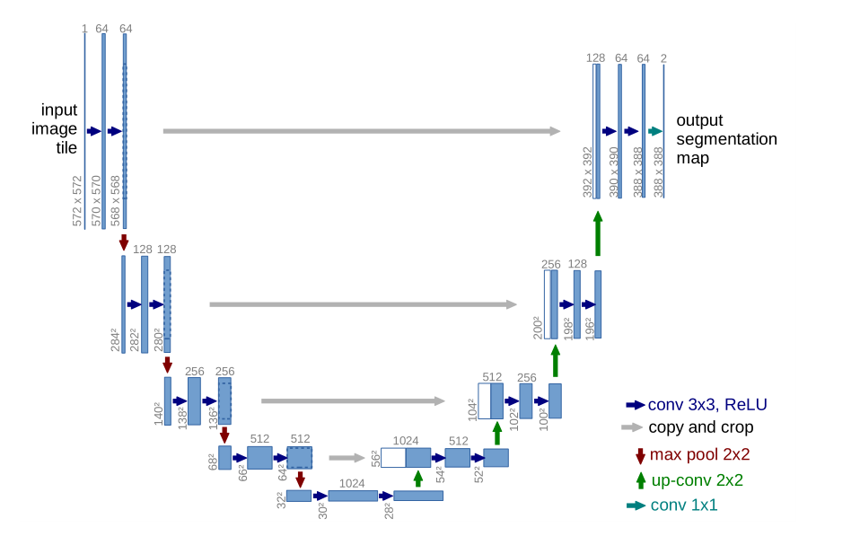
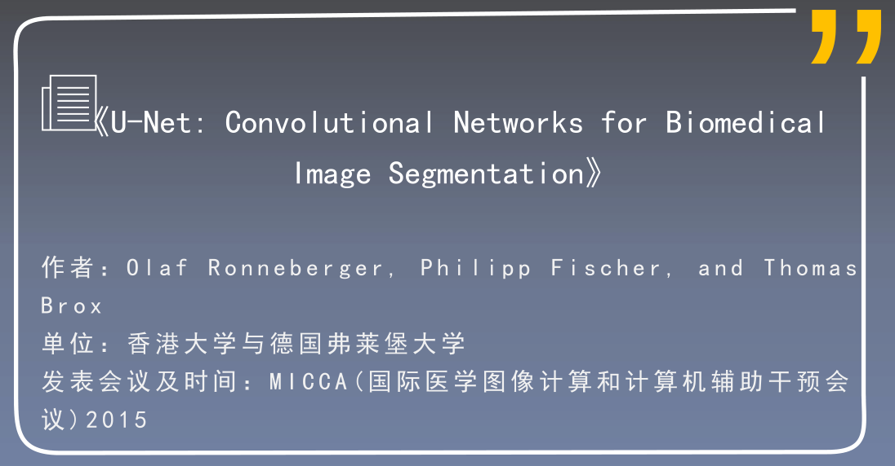
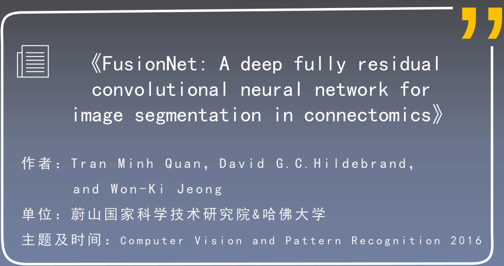
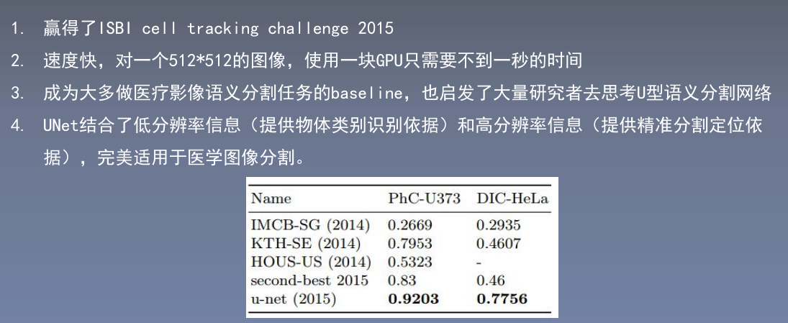

# 1.摘要部分
## 1.1 U-Net摘要
- 提出了一种可以通过数据增强更高效的利用可用样本的网络和训练策略。
>  we present a network and training strategy that relies on the strong use of data augmentation to use the available annotated samples more efficiently  

 - 这种网络架构由一个用来捕获上下文信息的收缩路径，和一个用来精确定位的对称的扩张路径组成。(提出了编码器和解码器的概念)
 >  The architecture consists of a contracting path to capture context and a symmetric expanding path that enables precise localization   

- 此模型可以通过非常少的样本来做端到端的训练，同时得到了2015年非常好的效果，ISBI挑战赛。  
> We show that such a network can be trained end-to-end from very few images and outperforms the prior best method (a sliding-window convolutional network) on the ISBI challenge for segmentation of neuronal structures in electron microscopic stacks  

- 除此之外，模型比较快，512x512的图片在2015年的cpu上分割时间少于一秒钟。
>  Moreover, the network is fast. Segmentation of a 512x512 image takes less than a second on a recent GPU.

## 1.2 FusionNet摘要
- FusionNet充分利用了机器学习中的最新创新（2016），例如语义分割和 **残差网络**（可以有效解决梯度消失或者梯度爆炸问题），还做了 **基于求和的跳跃链接**使更深的网络架构可以做到更精确的分割。
> FusionNet
leverages the latest advances in machine learning, such as semantic segmentation and residual neural networks, with the novel introduction of summation-based skip connections to allow a much deeper network architecture for a more accurate segmentation.  

# 2.Introduction
## 2.1 U-Net的引言
- CNN的发展历程：  
最近两年（2015）深度卷积网络在计算机视觉领域任务中取得了state-of-the-art的效果。卷积网络已经存在了非常长的时间，他们由于受限于可训练的数据集的大小和可搭建的网络的大小而没能取得成功。后来在imagenet挑战赛中，用监督学习训练了8层和数百万参数的网络而取得了成功。  
> In the last two years, deep convolutional networks have outperformed the state of the art in many visual recognition tasks, e.g. [7,3]. While convolutional networks have already existed for a long time [8], their success was limited due to the size of the available training sets and the size of the considered networks. The breakthrough by Krizhevsky et al. [7] was due to supervised training of a large network with 8 layers and millions of parameters on the ImageNet dataset with 1 million training images. Since then, even larger and deeper networks have been trained [12].

- 前人方法以及优缺点：  
卷积神经网络一开始用在了图像分类中，但是某些视觉任务中特别是医学领域需要输出位置信息，故提出了通过滑动窗口根据目标像素周围的像素来判断类别的方法。  
  - 优点：  
    - 可以输出位置信息。
    - 通过patch来处理图像，相当于做了数据增强。
  - 缺点：  
    - 由于需要分别跑每一个patch，所以非常慢，由于patch中有重叠部分，所以有非常多的冗余信息。
    - 需要在位置精度和上下文信息中做一个权衡。

- 提出FCN，引出本文网络架构  
  - fcn的主要思想:
  > The main idea in [9] is to supplement a usual contracting network by
successive layers, where pooling operators are replaced by upsampling operators.

  - 本文也是将收缩路径的特征图和上采样的特征图进行融合，以达到精确定位的目标。
  - 对边缘的像素进行了优化：
  >  To predict the pixels in the border region of the image, the missing context is extrapolated by mirroring the input image.This tiling strategy is important to apply the network to large images, since otherwise the resolution would be limited by the GPU memory.

- 数据增强的必要性：  
医学图像数据集非常少，数据增强是很重要的环节。
- 对于连接紧密的细胞，通过增加权重的方式来提升图像分割的准确率  
# 3.网络架构
## 3.1 U-Net网络架构
  
- 医学图像一边为灰度图像，输入图像的通道数为1
- 没有进行padding所以经过卷积层后图像的尺寸会变化
- 在每一个下采样后通道数翻倍，上采样时通道数减半
- 最后的1x1卷积是用来将64通道的特征图和最后想要的而分类图做映射

# 4.实验
## 4.1Unet实验
U-Net采用了0.99的大动量可以根据更多的之前的训练数据来更新当前的参数
- 加权的损失函数来更好的分割细胞边界
- 数据增强

# 5.实验结果
##5.1U-Net的实验结果

# 1.两篇论文的基本信息  
U-Net和FusionNet都是医学分割的模型
  
  
# 2.论文的创新点以及成就

